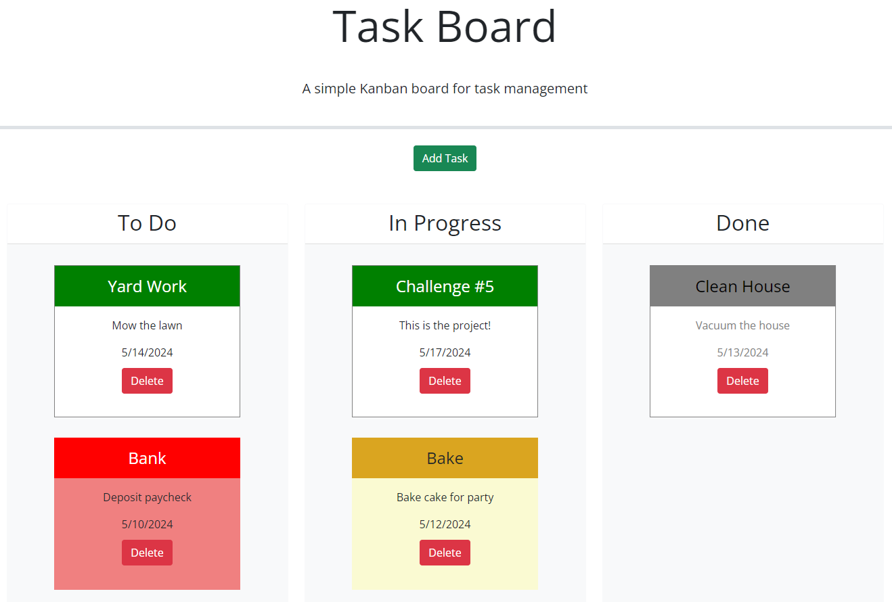

# Task Board

## Description

### User Story

This application was built to assist a project manager manage several tasks.  The board shows three columns in which display all tasks entered and the status of the tasks: "to do", "in progress", and "done".  The project manager will be able to create a new task to be displayed on the board.  The project manager will be able to enter a task title, a due date, and a description of the task.  Once saved, the task will immediately appear in the "to do" column of the board.  when the project is started, the project manager can click and drag the task to the "in progress" column and when complete, the project manager can click and drag the task to the "done" column.  Tasks can also be dragged back to any of the previous columns.  The color scheme of the tasks will change depending on their due date: green for future due dates, yellow for tasks due today, and red for tasks that are overdue.  The color scheme of completed tasks will be a subdued grey color scheme.  Tasks can be deleted by clicking the delete button.

### Student Experience

I'm not going to lie.  This was a challenging task for me.  Working with the different third party API's taught me to rethink the logic with which I have learned to code.  So far, I have known exactly where and what everything is because I put it there.  Now, I am dependant on code built by others.  I can't just copy and paste code and expect it to work in the same way that I can't just glue a light switch to the wall and expect that to work.  There is a "hooking up" process where I need to change the variables in the third party API top match my own.  Completing this project was very slow-going at first but got better as I got the hang of it.  To be honest, I hated this challenge (at first) in the same way I hate vegetables: I didn't like it but I know that it was good for me!  I'm feeling much more confident at the end of the project and I am curious how much I will be using this in the future.  I also think this gave me a glimpse of upcoming group projects where I will be in a position where I have to depend on code built by others.  Looking forward to more challenges and expanding my skill-set...

## Installation

N/A

## Usage

Anyone with the link to the application (https://orian42.github.io/todolist/) can utilize it.  To use, begin by adding tasks by clicking the "Add Task" button at the top of the page.  Fill out the task details when the modal display appears then click "Save Task" to save the task.  The "Cancel" button can be clicked if the user does not want to keep the task at this point.  All new tasks will appear in the "To Do" column.  Tasks can be clicked and dragged to other columns depending on their status.  Unwanted tasks on the task board can be permanently deleted by clicking on the "Delete" button on the appropriate task card.  Task cards will save to Local storage and will be immediately recalled and displayed properly when the application is opened on the same computer on which the tasks were entered.

## Credits

No other person aided in the creation of this application; however, some jQuery UI API's were copied and utilized: Draggable, Droppable, and Dialog (Modal Form).  The code for these API's can be found on the jQuery User Interface site at https://jqueryui.com.  Also, research into additional commands was conducted using multiple websites too numerous to name.  However, one that I would like to name specifically was the Xpert Learning Assistant which was an invaluable tool for me in the creation of this application.

## License

Please refer to the LICENSE in the repo.
